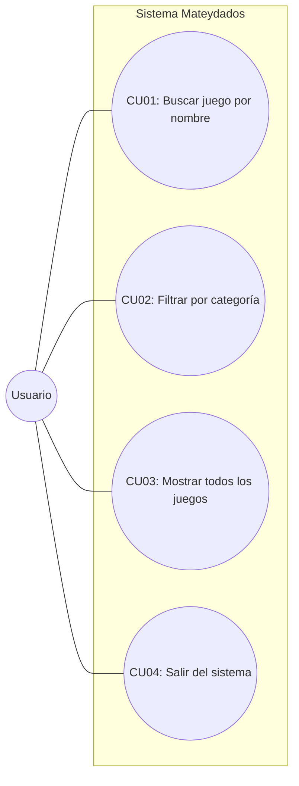

# Matesydados

## Diagrama de Casos de Uso

  ---
### CU 1: Buscar juego por nombre
* **Actor:** Usuario
* **Precondición:** El catálogo de juegos (`datos/juegos.json`) fue cargado en memoria al iniciar la aplicación.
* **Flujo Principal:**
  1. El usuario selecciona la opción `1` ("Buscar juego por nombre") en el menú de la terminal.
  2. El sistema solicita ingresar el nombre del juego de mesa.
  3. El usuario ingresa el nombre (ej. "Catan").
  4. El sistema consulta en la clase `Catalogo` buscando coincidencias por título (sin diferenciar mayúsculas y minúsculas).
  5. El sistema muestra en pantalla la ficha técnica detallada del juego utilizando la representación de la clase `Juego` (`__repr__`).
* **Flujo Alternativo:**
  * Si el juego no se encuentra en el catálogo, el sistema informa: *"No se encontro el juego (nombre del juego)"*.

  ---

### CU 2: Filtrar por categoría
* **Actor:** Usuario
* **Precondición:** El catálogo de juegos está cargado en memoria.
* **Flujo Principal:**
  1. El usuario selecciona la opción `2` ("Filtrar por categoría") en la terminal.
  2. El sistema solicita ingresar el nombre de la categoría buscada (ej. "Estrategia").
  3. El usuario ingresa la categoría.
  4. El sistema recorre los objetos `Juego` en `Catalogo` recopilando aquellos cuya lista de categorías incluya el texto ingresado.
  5. El sistema imprime en pantalla la lista de juegos filtrados con sus respectivos atributos.
* **Flujo Alternativo:**
  * Si ningún juego coincide con la categoría indicada, el sistema muestra el mensaje: *"No se encontraron juegos pertenecientes a la categoría ingresada"*.

  ---

### CU 3: Mostrar todos los juegos
* **Actor:** Usuario
* **Precondición:** El catálogo de juegos está cargado en memoria.
* **Flujo Principal:**
  1. El usuario selecciona la opción `3` ("Mostrar todos los juegos") en el menú principal.
  2. El sistema invoca al método `mostrar_todos()` de la clase `Catalogo`.
  3. El sistema imprime en la consola la ficha completa de cada uno de los juegos cargados en el dataset.
* **Flujo Alternativo:**
  * Si el catálogo se encuentra vacío, el sistema indica: *"No hay juegos cargados"*.

  ---

### CU 4: Salir del sistema
* **Actor:** Usuario
* **Flujo Principal:**
  1. El usuario selecciona la opción `4` ("Salir").
  2. El sistema muestra un mensaje de despedida (*"Gracias por visitarnos! Hasta luego."*) y finaliza el bucle de ejecución.

