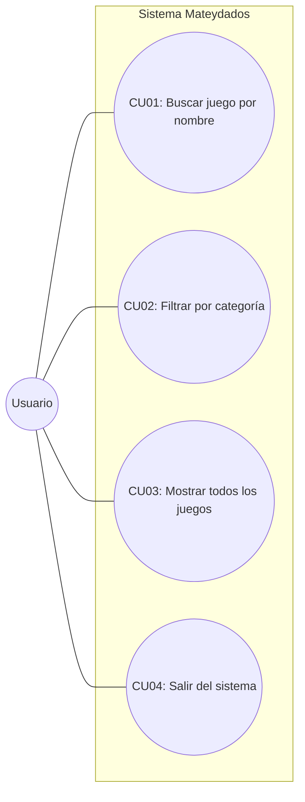

# Matesydados

## Diagrama de Casos de Uso

```mermaid
graph LR
    subgraph Mateydados ["Sistema Mateydados"]
        CU1(("CU01: Buscar juego por nombre"))
        CU2(("CU02: Filtrar por categoría"))
        CU3(("CU03: Mostrar todos los juegos"))
        CU4(("CU04: Salir del sistema"))
    end

    Usuario((Usuario)) --- CU1
    Usuario --- CU2
    Usuario --- CU3
    Usuario --- CU4
```

---

### CU 1: Buscar juego por nombre
* **Actor:** Usuario
* **Precondición:** El catálogo de juegos (`datos/juegos.json`) fue cargado en el Árbol BST (`_arbol_nombre`) al iniciar la aplicación.
* **Flujo Principal:**
  1. El usuario selecciona la opción `1` ("Buscar juego por nombre") en el menú de la terminal.
  2. El sistema solicita ingresar el nombre del juego de mesa.
  3. El usuario ingresa el nombre (ej. "Catan").
  4. El sistema consulta en la clase `Catalogo`, delegando la búsqueda al árbol BST (`ArbolBST.buscar`) (sin distinguir mayúsculas ni minúsculas).
  5. El sistema muestra en pantalla la ficha técnica detallada del juego utilizando el método `__repr__` de la clase `Juego`.
* **Flujo Alternativo:**
  * **A1 (Texto vacío):** Si el usuario presiona ENTER sin escribir nada, el sistema informa *"No ha ingresado ningún nombre"* y regresa al menú.
  * **A2 (Juego inexistente):** Si el juego no se encuentra en el árbol, el sistema informa *"No se encontró el juego 'nombre'"*.

---

### CU 2: Filtrar por categoría
* **Actor:** Usuario
* **Precondición:** El catálogo de juegos está cargado en memoria (`self._juegos`).
* **Flujo Principal:**
  1. El usuario selecciona la opción `2` ("Filtrar por categoría") en la terminal.
  2. El sistema muestra la lista de categorías disponibles utilizando `obtener_categorias_disponibles()`.
  3. El sistema solicita ingresar el nombre de la categoría buscada (ej. "Estrategia").
  4. El usuario ingresa la categoría.
  5. El sistema recorre la lista de objetos `Juego` en `Catalogo` obteniendo los juegos que incluyan dicha categoría.
  6. El sistema imprime en pantalla el total de juegos encontrados y la lista filtrada con sus fichas técnicas.
* **Flujo Alternativo:**
  * **A1 (Entrada vacía):** Si no ingresa texto, el sistema indica *"No ingresaste ninguna categoría"*.
  * **A2 (Sin coincidencias):** Si ningún juego coincide, el sistema indica *"No se encontraron juegos pertenecientes a la categoría ingresada 'categoría'"*.

---

### CU 3: Mostrar todos los juegos
* **Actor:** Usuario
* **Precondición:** El catálogo de juegos está cargado en memoria.
* **Flujo Principal:**
  1. El usuario selecciona la opción `3` ("Mostrar todos los juegos") en el menú principal.
  2. El sistema invoca al método `mostrar_todos()` de la clase `Catalogo`.
  3. El sistema imprime en la consola la ficha completa de cada uno de los juegos cargados en el dataset.
* **Flujo Alternativo:**
  * **A1 (Catálogo vacío):** Si el catálogo se encuentra vacío, el sistema indica *"No hay juegos cargados"*.

---

### CU 4: Salir del sistema
* **Actor:** Usuario
* **Flujo Principal:**
  1. El usuario selecciona la opción `4` ("Salir").
  2. El sistema muestra un mensaje de despedida (*"Gracias por visitarnos! Hasta luego."*) y finaliza el bucle de ejecución.

