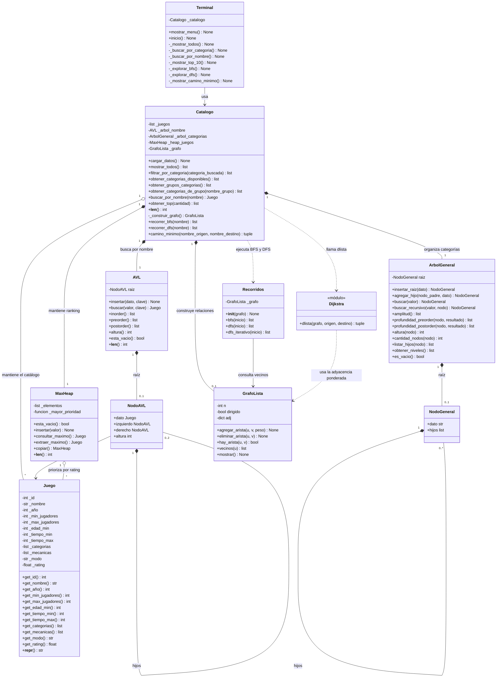

# Diagrama de Clases (Notación UML)

```mermaid
classDiagram
    class Juego {
        -int _id
        -str _nombre
        -int _año
        -int _min_jugadores
        -int _max_jugadores
        -int _edad_min
        -int _tiempo_min
        -int _tiempo_max
        -list _categorias
        -list _mecanicas
        -str _modo
        -float _rating
        +get_id() int
        +get_nombre() str
        +get_año() int
        +get_min_jugadores() int
        +get_max_jugadores() int
        +get_edad_min() int
        +get_tiempo_min() int
        +get_tiempo_max() int
        +get_categorias() list
        +get_mecanicas() list
        +get_modo() str
        +get_rating() float
        +__repr__() str
    }

    class NodoAVL {
        +dato Juego
        +izquierdo NodoAVL
        +derecho NodoAVL
        +altura int
    }

    class AVL {
        -NodoAVL raiz
        +insertar(dato, clave) None
        +buscar(valor, clave) Juego
        +inorder() list
        +preorder() list
        +postorder() list
        +altura() int
        +esta_vacio() bool
        +__len__() int
    }

    class NodoGeneral {
        +dato str
        +hijos list
    }

    class ArbolGeneral {
        -NodoGeneral raiz
        +insertar_raiz(dato) NodoGeneral
        +agregar_hijo(nodo_padre, dato) NodoGeneral
        +buscar(valor) NodoGeneral
        +buscar_recursivo(valor, nodo) NodoGeneral
        +amplitud() list
        +profundidad_preorder(nodo, resultado) list
        +profundidad_postorder(nodo, resultado) list
        +altura(nodo) int
        +cantidad_nodos(nodo) int
        +listar_hijos(nodo) list
        +obtener_niveles() list
        +es_vacio() bool
    }

    class Catalogo {
        -list _juegos
        -AVL _arbol_nombre
        -ArbolGeneral _arbol_categorias
        -MaxHeap _heap_juegos
        -GrafoLista _grafo
        +cargar_datos() None
        +mostrar_todos() list
        +filtrar_por_categoria(categoria_buscada) list
        +obtener_categorias_disponibles() list
        +obtener_grupos_categorias() list
        +obtener_categorias_de_grupo(nombre_grupo) list
        +buscar_por_nombre(nombre) Juego
        +obtener_top(cantidad) list
        +__len__() int
        -_construir_grafo() GrafoLista
        +recorrer_bfs(nombre) list
        +recorrer_dfs(nombre) list
        +camino_minimo(nombre_origen, nombre_destino) tuple
    }

    class Terminal {
        -Catalogo _catalogo
        +mostrar_menu() None
        +inicio() None
        -_mostrar_todos() None
        -_buscar_por_categoria() None
        -_buscar_por_nombre() None
        -_mostrar_top_10() None
        -_explorar_bfs() None
        -_explorar_dfs() None
        -_mostrar_camino_minimo() None
    }

    class MaxHeap {
        -list _elementos
        -funcion _mayor_prioridad
        +esta_vacio() bool
        +insertar(valor) None
        +consultar_maximo() Juego
        +extraer_maximo() Juego
        +copiar() MaxHeap
        +__len__() int
    }

    class GrafoLista {
        -int n
        -bool dirigido
        -dict adj
        +agregar_arista(u, v, peso) None
        +eliminar_arista(u, v) None
        +hay_arista(u, v) bool
        +vecinos(u) list
        +mostrar() None
    }

    class Recorridos {
        -GrafoLista _grafo
        +__init__(grafo) None
        +bfs(inicio) list
        +dfs(inicio) list
        +dfs_iterativo(inicio) list
    }

    class Dijkstra {
        <<módulo>>
        +dlista(grafo, origen, destino) tuple
    }

    Terminal --> Catalogo : usa
    Catalogo "1" o-- "*" Juego : mantiene el catálogo
    Catalogo "1" *-- "1" AVL : busca por nombre
    AVL "1" *-- "0..1" NodoAVL : raíz
    NodoAVL "1" *-- "0..2" NodoAVL : hijos
    NodoAVL --> Juego : almacena
    Catalogo "1" *-- "1" ArbolGeneral : organiza categorías
    ArbolGeneral "1" *-- "0..1" NodoGeneral : raíz
    NodoGeneral "1" *-- "0..*" NodoGeneral : hijos
    Catalogo "1" *-- "1" MaxHeap : mantiene ranking
    MaxHeap "1" o-- "*" Juego : prioriza por rating
    Catalogo "1" *-- "0..1" GrafoLista : construye relaciones
    Catalogo ..> Recorridos : ejecuta BFS y DFS
    Recorridos --> GrafoLista : consulta vecinos
    Catalogo ..> Dijkstra : llama dlista
    Dijkstra ..> GrafoLista : usa la adyacencia ponderada
```
