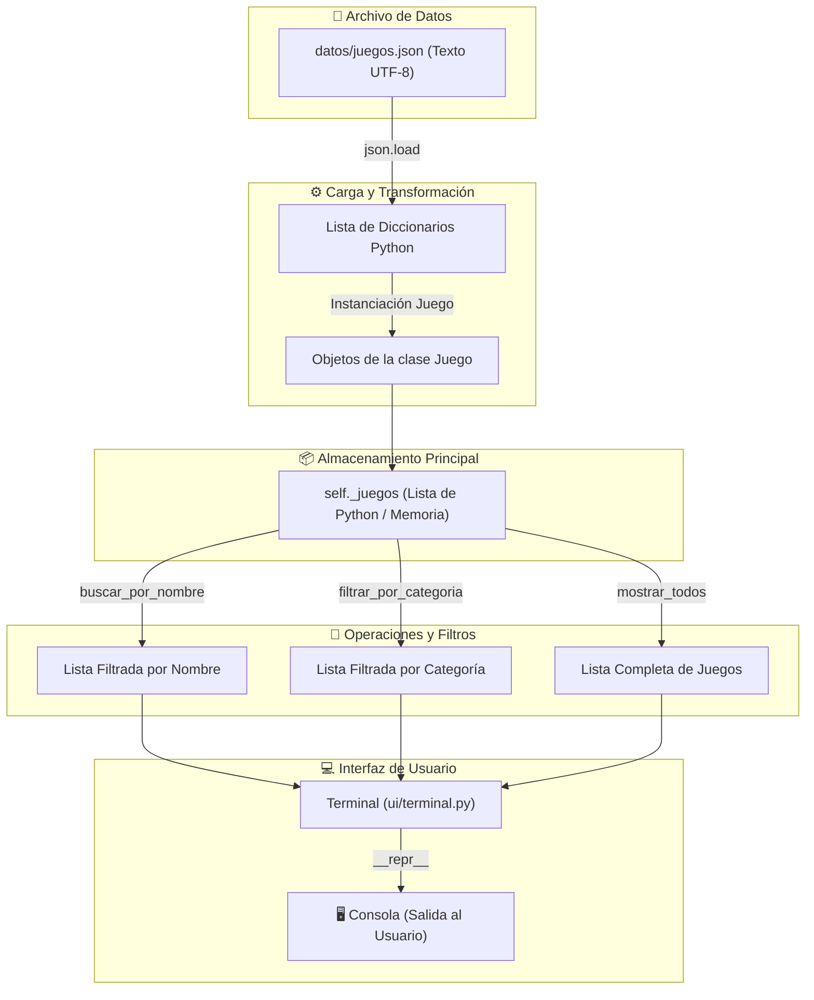

# Matesydados

## Flujo de Datos del Sistema

```mermaid
graph TD
    subgraph Origen ["📁 Archivo de Datos"]
        JSON["datos/juegos.json (Texto UTF-8)"]
    end

    subgraph Carga ["⚙️ Carga y Transformación"]
        JSON -->|json.load| DICT["Lista de Diccionarios Python"]
        DICT -->|Instanciación Juego| OBJS["Objetos de la clase Juego"]
    end

    subgraph Estructura ["📦 Almacenamiento Principal"]
        OBJS --> LISTA["self._juegos (Lista de Python / Memoria)"]
    end

    subgraph Consultas ["🔎 Operaciones y Filtros"]
        LISTA -->|buscar_por_nombre| BUSQ["Lista Filtrada por Nombre"]
        LISTA -->|filtrar_por_categoria| CAT["Lista Filtrada por Categoría"]
        LISTA -->|mostrar_todos| TODOS["Lista Completa de Juegos"]
    end

    subgraph UI ["💻 Interfaz de Usuario"]
        BUSQ --> TERMINAL["Terminal (ui/terminal.py)"]
        CAT --> TERMINAL
        TODOS --> TERMINAL
        TERMINAL -->|__repr__| PANTALLA["🖥️ Consola (Salida al Usuario)"]
    end
```
